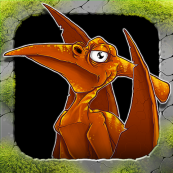

# DinoCopterGame v1.0.0.0 (pre-pre-pre alpha; DinoTaxi project codename)

A "original" game (dos game Ugh! remake, indeed) written by Fern's Blossom Studio with MonoGame that targets old sweet WP7. :)

My main goal is/was: adapdation for "multi-platform' UWP (xbox, windows 10/11 desktop, and windows 10 mobile with Astoria too).  

## Screenshot(s)

## My 2 cents
- dinocopter.xap R.E.
- WP7 src code research (very quick, no deep learning yet!)
- I started to adapt the src code for W10M... 

## Original game scenario

"Have you ever wonder how it would be to work as a taxi driver? Driving helicopter? Carrying dinosaurs? Who don't have to worry about traffic jam but to pterodactyls and angry triceratops? No? Then you should! :-)

Check your skills as caveman taxi driver in many levels.
Face running time, raging triceratops, flying pterodactyls, sharp rocks and many other obstacles on your way."

## Requirements
* MonoGame FrameWork DirectX v3.7 (or higher)
* [Visual Studio 2022 Community Edition](https://visualstudio.microsoft.com/) (or 2022 Preview)

## References
- https://fernblossomstudio.blogspot.com/ Fern's Blossom Studio 
- https://www.youtube.com/watch?v=BcEZ2T1j-CE Gameplay trailer from Fern's Blossom Studio newest production: Dino Taxi!

## . 
As is. No support.RnD only

## .
[m][e] 2024
