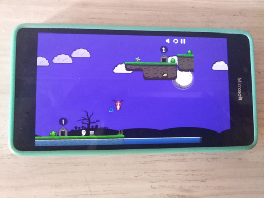

# Silly Ghosts (Ugh! remake) - uwp branch 

## Screenshot(s)

## About
My "RnD" of cool Silly Gosts (Ugh! remake) game. This in my 2nd attempt to create some modern Ugh! UWP replica (1st thing was DinoCopter, and it was epic fail)))

## My 2 cents
- UWP + 10240 Windows SDK & Monogame 3.8 support added (for my 12-yeard old Sony Vaio notebook)))
- Micro-RnD (I specially tried DotPeek for DoB R.E., and result is 0% of bugs, that's ideal automation!)))
- W10M Touchpanel control added to this UWP game :)
- Also, this UWP app is ready for "desktop devices with kbd input" (for better PC/notebook gaming process) 

## References
- https://gniriki.itch.io/silly-ghosts Original Silly-Ghosts project
- https://github.com/gniriki Original Silly-Ghosts' developer
- Silly Ghosts page (AG.RU) : https://ag.ru/games/silly-ghosts 

## ..
AS IS. No support. RnD only / DIY

## .
[m][e] October, 26 2024

